<p align="center">
  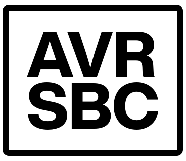
</p>

<h1 align="center">avr-basic-sbc</h1>

<p align="center">
  <strong>An ATmega1284P-based single board computer</strong><br>
  Composite video output &bull; PS/2 keyboard input &bull; Tiny BASIC interpreter with graphics, sound, GPIO, and serial I/O
</p>

<p align="center">
  <table align="center">
    <tr>
      <td align="center">
        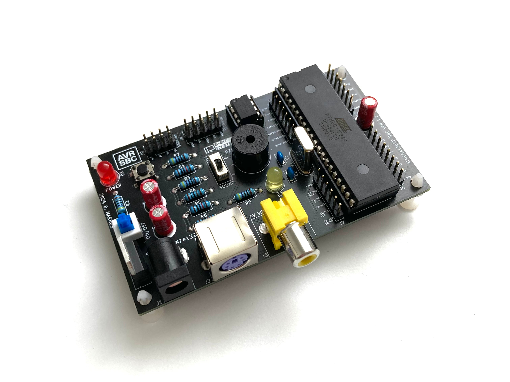
      </td>
      <td align="center">
        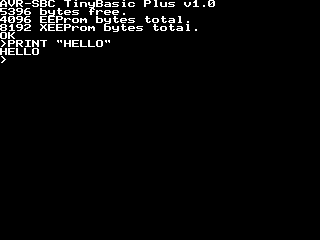
      </td>
    </tr>
  </table>
</p>

---

## Table of Contents

- [Overview](#overview)
- [Features](#features)
- [Hardware](#hardware)
  - [Main Board](#main-board)
  - [Schematic](#schematic)
  - [Bill of Materials](#bill-of-materials)
  - [Pin Mapping](#pin-mapping)
- [Firmware](#firmware)
  - [Architecture](#architecture)
  - [Graphics & Video](#graphics--video)
  - [Tiny BASIC Interpreter](#tiny-basic-interpreter)
  - [Building & Flashing](#building--flashing)
- [Boomerang Shields](#boomerang-shields)
  - [Serial Boomerang Shield](#serial-boomerang-shield)
  - [Bluetooth Boomerang Shield](#bluetooth-boomerang-shield-perfboard-prototype)
  - [Seven Segment Display Extension](#seven-segment-display-extension-perfboard-prototype)
- [SBC Studio](#sbc-studio)
  - [Code Editor & Serial Upload](#code-editor--serial-upload)
  - [Bitmap Editor & Loader](#bitmap-editor--loader)
  - [MIDI to BAS Converter](#midi-to-bas-converter)
- [BASIC Examples](#basic-examples)
  - [Hello World](#hello-world)
  - [Graphics Demos](#graphics-demos)
  - [Games](#games)
  - [Sound Examples](#sound-examples)
  - [Hardware I/O Examples](#hardware-io-examples)
- [Known Limitations & Future Ideas](#known-limitations--future-ideas)
- [Personal Notes](#personal-notes)
- [Inspirations & Credits](#inspirations--credits)

---

## Overview

I always loved retrocomputing. As a kid I played around with a Commodore 64 - which I still own to this day - and I was always fascinated by the fact that computers are really just embedded systems, just nowadays unimaginably fast ones. This project grew out of that fascination.

The idea is not completely original. Many people have built similar things, and my two biggest inspirations were Jörg Wolfram's [AVR ChipBASIC](https://www.jcwolfram.de/projekte/avr/chipbasic/main.php) and Juan J. Martínez's [DAN64](https://www.usebox.net/jjm/dan64/). Neither was quite what I had in mind though - I wanted something simple to use, simple to develop for, and simple to build. A Tiny BASIC based single board computer with composite video output, a PS/2 keyboard, and some GPIO, all on a single through-hole PCB. So I decided to build my own, and here it is.

The **AVR-SBC** is an ATmega1284P-based single board computer running a Tiny BASIC interpreter. It generates a composite video signal (320×240, PAL) directly from the microcontroller, accepts input from a PS/2 keyboard, has an onboard buzzer for sound, and exposes GPIO pins for interacting with the outside world. There is also an external 25LC640 SPI EEPROM for storing programs and data - I particularly like using it to store bitmaps that can be drawn on the screen. The internal EEPROM of the ATmega1284P is available too, so a typical setup is storing a drawing program in the internal EEPROM and the actual bitmap data in the external one.

The whole thing is built with plain `avr-gcc` and `avrdude`. No Arduino framework, no dependencies - just good old C and a bit of assembly where the timing gets tight.

<p align="center">
  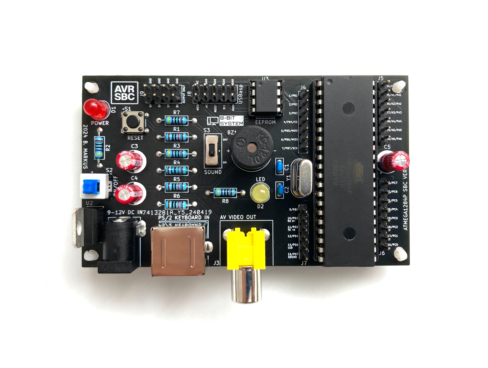
</p>

---

## Features

- **ATmega1284P** running at 16 MHz - 128 KB flash, 16 KB SRAM, 4 KB internal EEPROM
- **Composite video output** via RCA jack - 320×240 PAL, generated directly by the MCU
- **PS/2 keyboard input** - supports EN (QWERTY), DE (QWERTZ), and HU (QWERTZ) layouts, selectable at compile time
- **Tiny BASIC interpreter** - interactive prompt with 40×30 character terminal, blinking cursor, and a nice MS-DOS style 8×8 font
- **Graphics library** - pixel, line, rectangle, filled rectangle, circle, filled circle, ellipse, triangle, bitmap drawing, and more
- **Onboard piezo buzzer** - `TONE`, `TONEW`, `NOTONE` commands for playing melodies, with a slide switch to disable it
- **External 25LC640 SPI EEPROM** (8 KB) - accessible from BASIC via `XPOKE`, `XPEEK`, `XSAVE`, `XLOAD`, `XFORMAT`; great for storing bitmaps
- **Internal EEPROM** (4 KB) - accessible via `EPOKE`, `EPEEK`, `ESAVE`, `ELOAD`, `EFORMAT`
- **GPIO** - `DWRITE`, `DREAD`, `AWRITE`, `AREAD` commands using MightyCore-style pin numbering
- **UART1 serial interface** - for uploading programs from a PC via `SERLOAD`
- **Two onboard LEDs** - red power indicator, yellow user-controllable LED on PD6
- **Tactile reset button** and **power toggle switch**
- **5V regulated power** via L7805CV from a standard DC barrel jack
- **No Arduino framework** - built entirely with `avr-gcc` and `avrdude`
- **Boomerang shields** - stackable expansion boards for serial USB and Bluetooth program upload *(see [Boomerang Shields](#boomerang-shields))*
- **SBC Studio** - companion Python app for editing, uploading, bitmap conversion, and MIDI-to-BASIC conversion *(see [SBC Studio](#sbc-studio))*

---

## Hardware

### Main Board

The AVR-SBC is a fully through-hole PCB, which was a deliberate choice - it makes it easy to solder by hand and easy to modify. The board is revision **v1.2**. Versions v1.0 and v1.1 were non-working prototypes that got soldered, debugged, and eventually thrown away. The third one worked, and it has been working reliably ever since.

The heart of the board is the **ATmega1284P** in a DIP-40 socket, running off a 16 MHz HC49-U crystal. Power comes in through a standard 2.1mm DC barrel jack and is regulated to 5V by an **L7805CV** linear regulator. There are two LEDs - a red power indicator and a yellow user-controllable one on PD6. A tactile button handles reset, a toggle switch controls power, and a slide switch can disconnect the buzzer if you get tired of the beeping.

Video goes out through an RCA jack. The PS/2 keyboard connector is a right-angle Mini-DIN. There is also an external **25LC640** SPI EEPROM in a DIP-8 socket, and a 2×5 USBasp ISP programming header.

<p align="center">
  
</p>

---

### Schematic

<p align="center">
  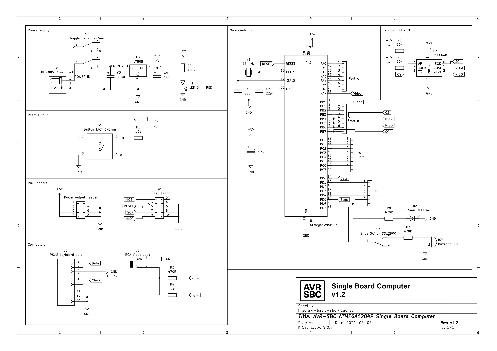
</p>

The full KiCad project including schematic, PCB, and Gerber files is available in the `schematic/` folder.

---

### Bill of Materials

| Reference | Qty | Value / Part |
|-----------|-----|--------------|
| U1 | 1 | ATmega1284P-P (DIP-40) |
| U2 | 1 | L7805CV - 5V linear regulator (TO-220) |
| U3 | 1 | 25LC640 - SPI EEPROM 8KB (DIP-8) |
| Y1 | 1 | 16 MHz crystal (HC49-U) |
| BZ1 | 1 | Buzzer (polarized, 1201 footprint) |
| C1, C2 | 2 | 22 pF - crystal load capacitors |
| C3 | 1 | 3.3 µF electrolytic |
| C4 | 1 | 1 µF electrolytic |
| C5 | 1 | 4.7 µF electrolytic |
| D1 | 1 | LED 5mm RED - power indicator |
| D2 | 1 | LED 5mm YELLOW - user LED (PD6) |
| R1, R5, R6 | 3 | 10 kΩ |
| R2, R3, R7, R8 | 4 | 470 Ω |
| R4 | 1 | 1 kΩ |
| S1 | 1 | Tactile button 6×6mm - reset |
| S2 | 1 | Toggle switch 7×7mm - power |
| S3 | 1 | Slide switch - buzzer on/off |
| J1 | 1 | DC barrel jack 2.1mm (DC-005) |
| J2 | 1 | PS/2 keyboard connector (Mini-DIN 6) |
| J3 | 1 | RCA video jack |
| J4–J7 | 4 | Pin headers - Port B, A, C, D GPIO |
| J8 | 1 | 2×5 pin header - USBasp ISP |
| J9 | 1 | 2×4 pin header - power output |

---

### Pin Mapping

The firmware uses **MightyCore-style** pin numbering for the ATmega1284P, which is also what the BASIC `DWRITE`, `DREAD`, `AWRITE`, and `AREAD` commands expect.

| Pin | Port | Function | Available? |
|-----|------|----------|------------|
| 0 | PB0 | PS/2 keyboard clock | ✗ reserved |
| 1–3 | PB1–PB3 | GPIO (J4) | ✓ |
| 4–7 | PB4–PB7 | SPI - EEPROM /CS, MOSI, MISO, SCK | shared |
| 8 | PD0 | PS/2 keyboard data | ✗ reserved |
| 9 | PD1 | UART1 TX | ✓ |
| 10 | PD2 | UART1 RX | ✓ |
| 11–12 | PD3–PD4 | GPIO (J7) | ✓ |
| 13 | PD5 | Video sync output | ✗ reserved |
| 14 | PD6 | Yellow LED | ✓ |
| 15 | PD7 | Buzzer / OC2A | ✓ |
| 16–23 | PC0–PC7 | GPIO (J6) - fully free | ✓ |
| 24–30 | PA0–PA6 | GPIO (J5) - exposed on header, but see note | ⚠ see note |
| 31 | PA7 | Video data output | ✗ reserved |

> **Note on PORTA:** The high-resolution line rendering routine writes pixel data to the entire PORTA register using the AVR `OUT` instruction (1 cycle, cycle-exact timing). This means the whole port is effectively owned by the video system at runtime. The pins are physically accessible on the J5 header, but using them as GPIO will corrupt the video output. PORTC is the recommended alternative for free GPIO pins.

---

## Firmware

### Architecture

The firmware is pure C (and one assembly file), built with `avr-gcc` and flashed with `avrdude`. No Arduino framework, no HAL, no magic. Everything is wired up by hand.

The three hardware timers are each assigned a dedicated role and they all have to coexist without stepping on each other, which was honestly one of the trickier parts of getting this running:

| Timer | Role |
|-------|------|
| Timer0 | 1 ms system tick (CTC mode) - used by `DELAY` and the tone duration counter |
| Timer1 | Composite video sync and scanline generation |
| Timer2 | Tone output on OC2A / PD7 - drives the buzzer via `TONE` / `TONEW` |

Memory is tight. The ATmega1284P has 16 KB of SRAM, and between the 9600-byte framebuffer (320×240 ÷ 8) and the 5500-byte BASIC program buffer, there is not much room left. It works, but there is not a lot of headroom to play with.

---

### Graphics & Video

The video output is the part I am most proud of - and the part that gave me the most trouble.

I originally used the Arduino TVout library like most similar projects do. It works, but the resolution is limited and I never really liked how it looked. I wanted 320×240, so I decided to write my own graphics library. That turned out to be a good decision, but it had consequences.

The line rendering function - `render_scanline()` in `render_line.S` - has to output one pixel every single clock cycle to hit 320 pixels per line at 16 MHz. There is simply no way to do that in C. Even a tight loop has overhead that breaks the timing. So I wrote it in AVR assembly, fully unrolled, 40 bytes × 8 bits per byte, outputting each pixel with a single `OUT` instruction directly to PORTA. No loop, no branches, just 320 consecutive `OUT` and `LSL` pairs.

The downside is that `OUT` writes to the entire port at once. That means **PORTA is permanently reserved** by the video system at runtime - the pins are physically on the J5 header, but you cannot use them as GPIO without corrupting the video output. PORTC has 8 fully free pins (J6) and is the recommended alternative. I never found a way around this limitation at 320×240, so I left it as-is. Ideas are welcome.

The graphics library (`graphics.c`) supports:

- Pixels, lines (Bresenham), horizontal and vertical lines
- Rectangles, filled rectangles, rounded rectangles
- Circles, filled circles, ellipses, filled ellipses
- Triangles, filled triangles
- Bitmap drawing from RAM or PROGMEM
- 8×8 font character rendering (MS-DOS style)
- Three draw modes: `SET`, `CLEAR`, `XOR`

The text terminal layer (`text.c`) sits on top of the graphics library and provides a 40×30 character terminal with scrolling, wrap-around, and a blinking cursor.

---

### Tiny BASIC Interpreter

The firmware is almost a direct port of **TinyBASIC**, originally written by Gordon Brandly as *68000 Tiny Basic*, then ported to C by Michael Field as *Arduino Basic*, and further developed by Scott Lawrence as *TinyBasicPlus*. I adapted it to be fully AVR C based - no Arduino framework anywhere.

The BASIC command set includes everything you would expect, plus a bunch of hardware-specific extensions:

| Category | Commands |
|----------|----------|
| Core | `PRINT`, `INPUT`, `LET`, `IF`/`THEN`, `GOTO`, `GOSUB`, `RETURN`, `FOR`/`TO`/`STEP`/`NEXT`, `END`, `STOP`, `REM` |
| Program | `RUN`, `LIST`, `NEW`, `LOAD`, `SAVE` |
| GPIO | `DWRITE`, `DREAD`, `AWRITE`, `AREAD` |
| Graphics | `DRAWPIX`, `DRAWLINE`, `DRAWRECT`, `DRAWCIRC`, `DRAWCHAR`, `GETPIX`, `CLS` |
| Sound | `TONE`, `TONEW`, `NOTONE` |
| Timing | `DELAY` |
| Internal EEPROM | `ESAVE`, `ELOAD`, `ELIST`, `EFORMAT`, `EPOKE`, `EPEEK` |
| External EEPROM | `XSAVE`, `XLOAD`, `XLIST`, `XFORMAT`, `XPOKE`, `XPEEK` |
| Serial | `SEROPEN`, `SERCLOSE`, `SERPRINT`, `SERREAD`, `SERLOAD` |
| Misc | `INKEY`, `MEM`, `RSEED`, `DELAY`, `PEEK`, `POKE` |

On startup, the board displays a splash screen with the firmware version and available memory, then drops into the interactive `>` prompt.

<p align="center">
  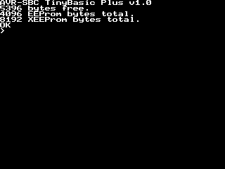
</p>

---

### Building & Flashing

**Requirements:** `avr-gcc`, `avr-libc`, `avrdude`, and `make`. On Windows, [WinAVR](https://winavr.sourceforge.net/) or Microchip Studio works fine. On Linux/macOS, install from your package manager.

```bash
# Build with default US/English keyboard layout
make

# Build with German QWERTZ layout
make KB_LAYOUT=DE

# Build with Hungarian QWERTZ layout
make KB_LAYOUT=HU

# Flash via USBasp programmer
make flash

# Show flash / SRAM / EEPROM usage
make size
```

The Makefile also exposes feature flags if you want to disable subsystems:

```bash
# Build without tone support (frees Timer2)
make FEAT_TONES=0

# Build without external EEPROM support
make FEAT_XEEPROM=0
```

**Flashing** is done via the 2×5 USBasp ISP header (J8). One important thing to be aware of: **the 5V pin on the ISP header is not connected**. The board must be powered through the DC barrel jack before you can flash it. This was a conscious decision on v1.2 to avoid back-feeding the microcontroller through the programmer.

The default programmer in the Makefile is `usbasp`. If you use something else, change the `-c usbasp` flag in the `flash` target accordingly.

---

## Boomerang Shields

After a while, connecting an FTDI USB-serial cable to PD2 and PD3 every time I wanted to upload a program got old really fast. So I opened KiCad again and designed a small stackable expansion board - the **Boomerang Shield**.

Why boomerang? Because of the shape. It has cutouts for the crystal and capacitors, and it follows the contour of the pin headers on the main board. I didn't mean for it to look like a boomerang, it just happened that way. I didn't want to redesign it - this is already the third revision of the main board - so the name stuck.

The shields use the same 2.54mm pin headers as the main board and stack directly on top. Pin headers are also broken out on the shield itself so GPIO access is not lost.

---

### Serial Boomerang Shield

<p align="center">
  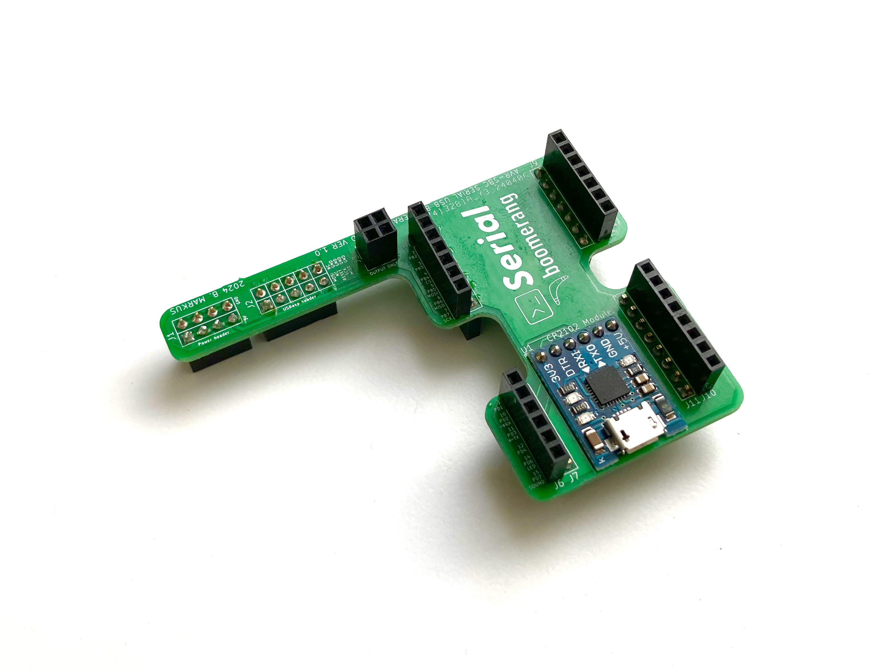
</p>

The serial boomerang shield is the official one. It carries a **CP2102 USB-to-serial bridge module**, connects to UART1 (PD2/PD3) of the AVR-SBC, and exposes a micro-USB connector. That's it - but now I can just leave it sitting on top of the board and upload programs with a single cable. Much better.

<p align="center">
  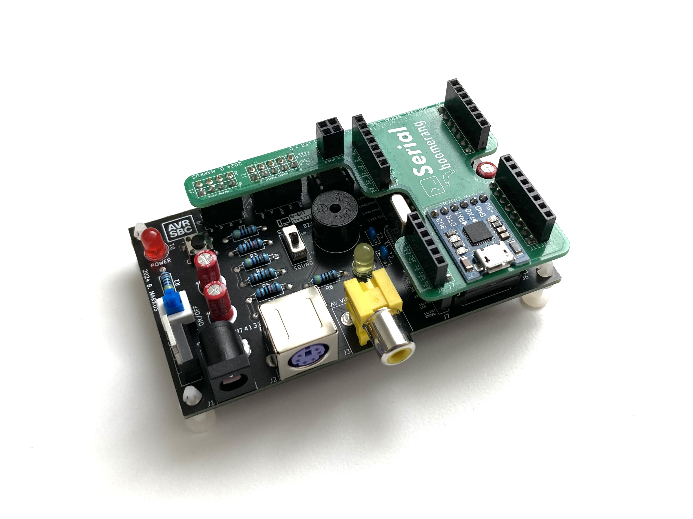
</p>

The KiCad project, schematic, and Gerber files for the serial boomerang shield are in the `boomerang-shields/serial-boomerang-shield/` folder. There is also an **empty boomerang shield template** in `boomerang-shields/empty-boomerang-shield-template/` if you want to design your own expansion.

<p align="center">
  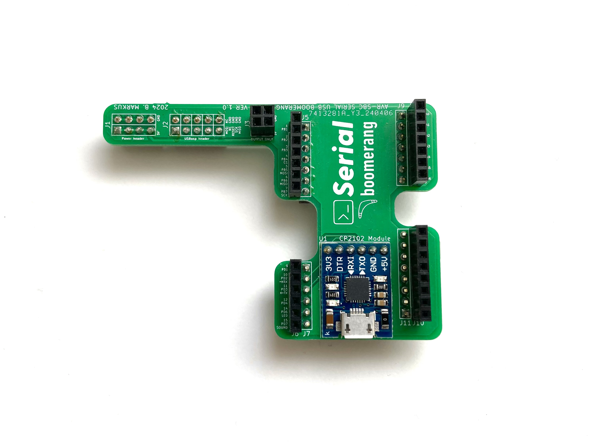
</p>

---

### Bluetooth Boomerang Shield *(perfboard prototype)*

Once I had the serial shield working, I started thinking about what else could plug into the same spot. The CP2102 module and an **HC-06 Bluetooth Classic module** have a very similar pinout - both are essentially a UART bridge. So I quickly wired one up on a perfboard with the same pin header footprint as the serial shield, plugged it in, and it worked.

<p align="center">
  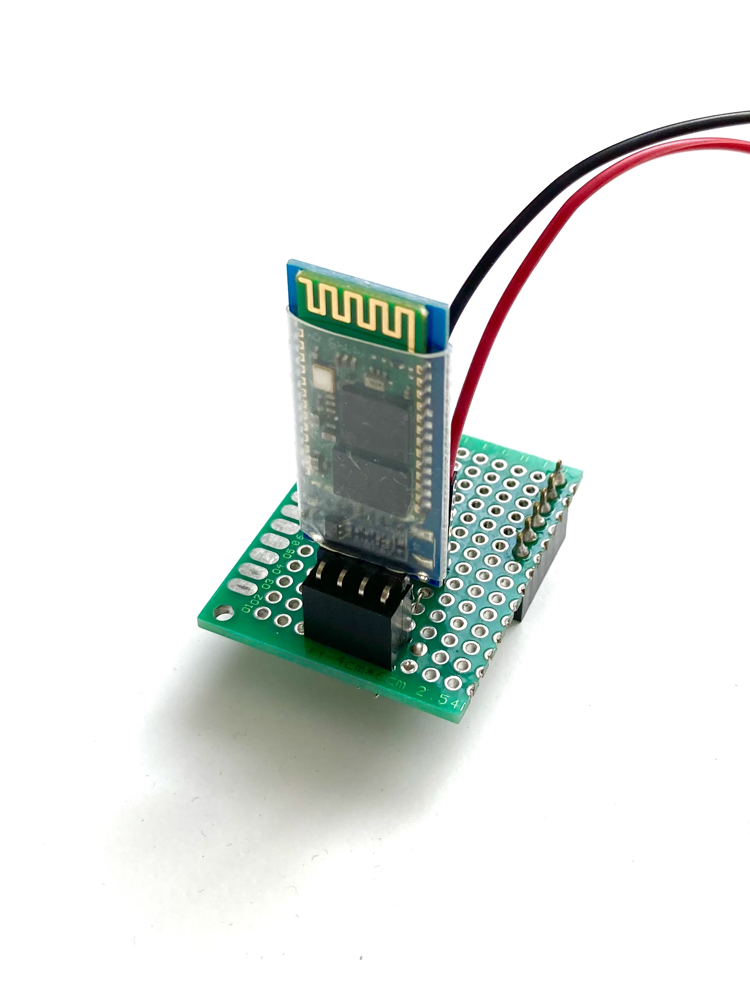
</p>

When the HC-06 is paired with a PC, it shows up as a virtual COM port via Bluetooth Classic SPP - exactly the same as the USB cable. That means I can upload BASIC programs to the AVR-SBC completely wirelessly. Which is, honestly, pretty amazing for a board built around an 8-bit microcontroller.

There is no official PCB design for the Bluetooth boomerang yet - it lives on a perfboard prototype for now. If I ever design it properly, I would probably use a better module, something like a Würth Elektronik Proteus-IV, a Skoll-I, or an ESP32-based module.

---

### Seven Segment Display Extension *(perfboard prototype)*

I also soldered together a small perfboard circuit with a **seven segment display** that stacks on top of the boomerang shield.

<p align="center">
  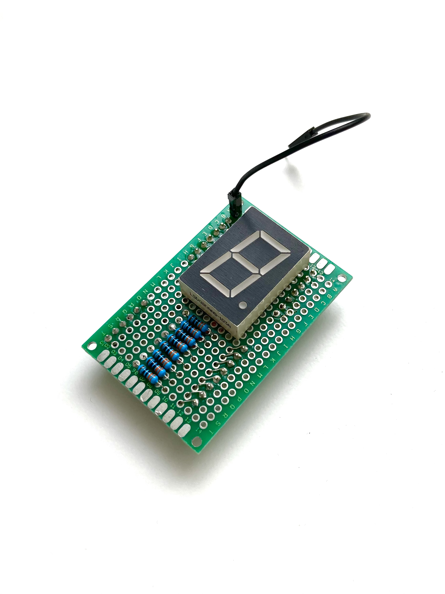
</p>

So at one point I had three layers: AVR-SBC → Serial Boomerang Shield → Seven Segment Extension. There is a BASIC example for it in the `examples/` folder.

<p align="center">
  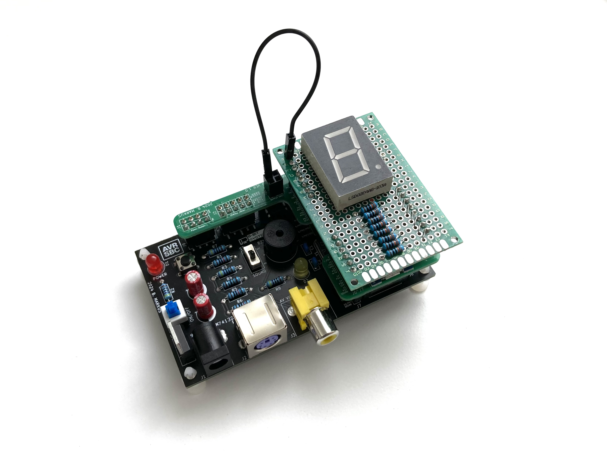
</p>

Like the Bluetooth shield, this one never got an official PCB design. It remains a perfboard prototype.

---

## SBC Studio

SBC Studio is a companion Python application for the AVR-SBC. It started as a simple serial uploader - basically just a way to type programs into the board really fast over UART1 without having to sit at a PS/2 keyboard. Over time it grew into something more, so I gave it a proper name.

<p align="center">
  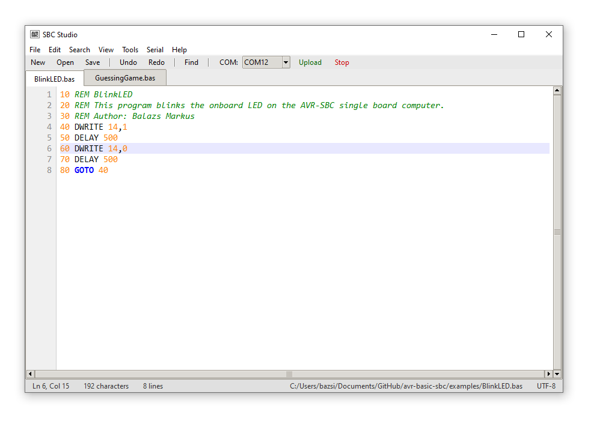
</p>

It requires Python 3 with `pyserial`. The bitmap tools also need `Pillow`, and the MIDI converter needs `pretty_midi`. Everything else is standard library.

```bash
pip install pyserial Pillow pretty_midi
python sbc-studio.py
```

The source is in `pc-tools/sbc-studio/`.

---

### Code Editor & Serial Upload

The main window is a lightweight `.bas` file editor with syntax highlighting, line numbers, tab support, find & replace, and undo/redo. It is nothing fancy, but it is comfortable enough for writing and editing Tiny BASIC programs.

The serial upload works by opening UART1 at 9600 baud and sending the program character by character - essentially simulating someone typing it in at the `>` prompt, just very fast. To upload, select your COM port from the toolbar, open or write a `.bas` file, and hit upload. The board receives it line by line exactly as if you had typed it yourself.

The keyboard layout for the PS/2 side (EN/DE/HU) is selected at firmware compile time, but the upload always goes through serial so the layout doesn't matter there.

---

### Bitmap Editor & Loader

This was a fun one to build. The **Bitmap Editor** takes any image file and converts it to a 128×64 monochrome bitmap suitable for the AVR-SBC screen. It has options for scaling, centering, dithering (Floyd-Steinberg), threshold control, rotation, flip, and background colour. The output is a standard 1-bit `.bmp` file.

The **Bitmap Loader** then uploads that `.bmp` to the AVR-SBC's external 25LC640 EEPROM via serial, using `XPOKE` commands split into batches. Once uploaded, a small BASIC program reads the bitmap back out with `XPEEK` and draws it pixel by pixel with `DRAWPIX`.

<p align="center">
  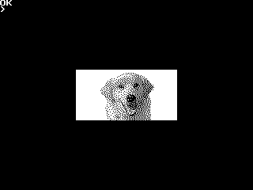
</p>

I included two examples in `pc-tools/sbc-studio/sbc-studio-output/bitmap-editor/` - a photo of our dog and a flower.

The reason I like this so much is that the external EEPROM fits a 128×64 bitmap very comfortably, and you never have to take the chip out of the socket to reprogram it. Everything goes over serial.

---

### MIDI to BAS Converter

At some point I realised that the `TONEW` command - which plays a tone at a given frequency and waits for it to finish - maps almost perfectly onto MIDI note data. So I built a converter that takes a single-track `.mid` file, extracts the notes, calculates frequencies and durations, and outputs a `.bas` file full of `TONEW` and `DELAY` statements that the AVR-SBC can play on its onboard buzzer.

The output is capped at around 5300 bytes to fit the BASIC program buffer. It is not going to replace a proper audio system, but hearing Für Elise come out of a piezo buzzer on a board you built yourself is genuinely satisfying. Two examples are included in `pc-tools/sbc-studio/sbc-studio-output/midi-to-bas-converter/` - Für Elise and Ode to Joy.

---

## BASIC Examples

Once the board was up and running I could finally sit down and actually write some programs for it in Tiny BASIC. The examples are all in the `examples/` folder. They cover a bit of everything - games, graphics demos, sound, and hardware I/O.

All of them can be typed in at the `>` prompt directly, or uploaded from a PC using SBC Studio.

---

### Hello World

The simplest possible start. The `PRINT` command outputs text to the screen.

```basic
PRINT "HELLO"
```

<p align="center">
  
</p>

---

### Graphics Demos

The graphics library makes it easy to draw shapes directly from BASIC. These examples show off what the 320×240 display can do.

| File | Description |
|------|-------------|
| `ConcentricCircles.bas` | Draws concentric circles filling the screen |
| `RandomRectangles.bas` | Fills the screen with randomly placed rectangles |
| `Spirograph.bas` | Spirograph-style pattern using lines and loops |
| `StarField.bas` | Scrolling star field effect |
| `BouncingBall.bas` | A ball bouncing around the screen |

<p align="center">
  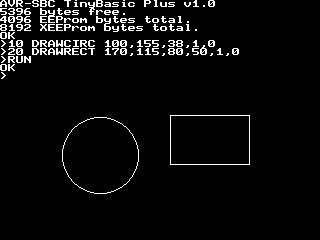
</p>

---

### Games

A few simple games that show off keyboard input, random numbers, and the graphics commands together.

| File | Description |
|------|-------------|
| `EatTheTargets.bas` | Move a cursor around the screen and eat targets |
| `GuessTheNumber.bas` | Classic guess the number game with hints |
| `SlotMachine.bas` | An ASCII slot machine |

---

### Sound Examples

These use the `TONE` and `TONEW` commands to play melodies on the onboard buzzer. The MIDI converter in SBC Studio was used to generate the two classical pieces.

| File | Description |
|------|-------------|
| `CMajorPiano.bas` | Plays a C major scale using the keyboard |
| `MelodyPlayer.bas` | A simple melody player |
| `furelise.bas` *(generated)* | Für Elise - in `pc-tools/sbc-studio/sbc-studio-output/midi-to-bas-converter/` |
| `odetojoy.bas` *(generated)* | Ode to Joy - in `pc-tools/sbc-studio/sbc-studio-output/midi-to-bas-converter/` |

---

### Hardware I/O Examples

These examples interact with the GPIO pins and show how `DWRITE`, `DREAD`, and the EEPROM commands work in practice.

| File | Description |
|------|-------------|
| `BlinkLED.bas` | Blinks the onboard yellow LED on PD6 using `DWRITE` |
| `SevenSegmentDisplay.bas` | Drives a seven segment display connected to PORTC |

<p align="center">
  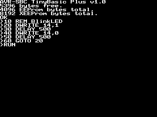
</p>

---

## Known Limitations & Future Ideas

The board works, and it works reliably. But it is not perfect, and I know exactly where the rough edges are.

---

### Hardware

**Decoupling capacitors** - when I designed the board I was quite casual with component choices, and I skipped the per-chip decoupling capacitors. There are bulk capacitors for the microcontroller and the L7805CV, but they are not following the reference design. If I were to redesign the board I would definitely add proper decoupling caps on every supply pin.

**No reverse polarity protection** - the DC input has no protection diode. Plugging in the barrel jack the wrong way around will likely kill the board. A simple series diode or a P-channel MOSFET would fix this.

**No Schottky diode on the ISP header** - to prevent back-feeding the microcontroller through the programmer's VCC pin, I simply left the 5V pin on the ISP header unconnected. It works, but a proper Schottky diode would be a cleaner solution. As it stands, the board must always be powered through the DC barrel jack when programming.

**PORTA reserved by the video system** - as described in the Firmware section, the cycle-exact line rendering routine writes to the entire PORTA register using the AVR `OUT` instruction. This means PA0–PA6 cannot be used as GPIO without corrupting the video output, even though the pins are physically accessible on the J5 header. Getting 320×240 resolution with proper timing while also making PORTA available as GPIO is an unsolved problem for this project. If you have an idea, I would love to hear it.

---

### Software & Features

**Boomerang shields without official PCBs** - the Bluetooth boomerang and the seven segment extension board are both perfboard prototypes. They work great but there are no KiCad files for them. At some point I would like to design proper PCBs for both - and when I do, I would probably swap the HC-06 for something more modern, like a Würth Elektronik Proteus-IV, a Skoll-I, or an ESP32-based module.

**Single-track MIDI only** - the MIDI to BAS converter in SBC Studio only handles single-track MIDI files. Multi-track files are not supported, which rules out a lot of MIDI content. Since the buzzer is monophonic anyway this is not a huge loss, but smarter track selection would be a nice improvement.

**Auto-run from EEPROM** - the firmware supports an `ENABLE_EAUTORUN` flag that automatically runs the program stored in internal EEPROM on boot, without showing the `>` prompt first. This is disabled by default but could be useful for standalone appliance-style deployments.

---

## Personal Notes

I started this project many years ago, then stopped, then restarted, then had a long pause. Many versions of KiCad were released in the meantime. AI systems started developing and becoming more and more advanced. And this project was still just there, waiting on a shelf somewhere between the other unfinished things. But occasionally when I came back to it, it made me very happy and I found it genuinely challenging.

Before this project I was usually defaulting to just using the Arduino framework - like the TVout-based firmware also did, and like many similar projects still do. But during this project I realized that with the power of real C and assembly you can get much further. Writing the line renderer in assembly, getting the timing right across three timers, squeezing everything into 16 KB of SRAM - none of that would have happened if I had stayed in Arduino land. So it was definitely a nice learning experience about myself too. Now there is no going back. Even the simplest things I do in low level C, and I have become really interested in assembly as well.

I am glad I have this project. I can't wait to see what the future brings with it - I am sure it will be exciting. And knowing myself, I will probably abandon it for a while again, and then one day come back and find something new to add. The hardware stays the same.

---

## Inspirations & Credits

### Inspiration Projects

This project would not exist without these two:

- **Jörg Wolfram** - [AVR ChipBASIC](https://www.jcwolfram.de/projekte/avr/chipbasic/main.php)
  The project that first showed me this kind of thing was possible on an AVR microcontroller.

- **Juan J. Martínez** - [DAN64](https://www.usebox.net/jjm/dan64/)
  A beautifully executed AVR-based home computer that was a big influence on the direction of this project.

---

### Tiny BASIC Lineage

The firmware interpreter is based on a long chain of ports and adaptations:

- **Gordon Brandly** - original *68000 Tiny Basic*
- **Michael Field** - ported to C as *Arduino Basic*
- **Scott Lawrence** - extended and maintained as [TinyBasicPlus](https://github.com/BleuLlama/TinyBasicPlus)

The AVR-SBC version is a bare-metal port of TinyBasicPlus, adapted for the ATmega1284P with no Arduino framework and extended with graphics, sound, EEPROM, and serial commands.

---

### Tools & Libraries

- [avr-gcc](https://gcc.gnu.org/wiki/avr-gcc) & [avr-libc](https://avr-libc.nongnu.org/) - the toolchain
- [avrdude](https://github.com/avrdudes/avrdude) - flashing utility
- [KiCad](https://www.kicad.org/) - schematic and PCB design
- [Python](https://www.python.org/) / [pyserial](https://github.com/pyserial/pyserial) / [Pillow](https://python-pillow.org/) / [pretty_midi](https://github.com/craffel/pretty-midi) - SBC Studio dependencies

---

<p align="center">
  
  <br>
  <em>Built with ❤️ and an 8-bit microcontroller</em>
</p>
